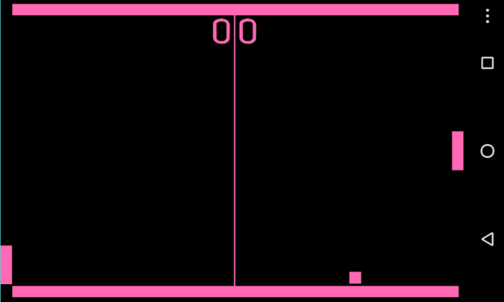

# Pong-Cross-Platform

Cross platform version of Pong. The game works on Windows and Android, using the same shared logic. Created during the first year of the Computer Science programme at the Rotterdam University of Applied Sciences.

## Screenshot

## Details

The game uses SFML, Monogame and the visitor design pattern. This allows it to run both on Windows and Android.

